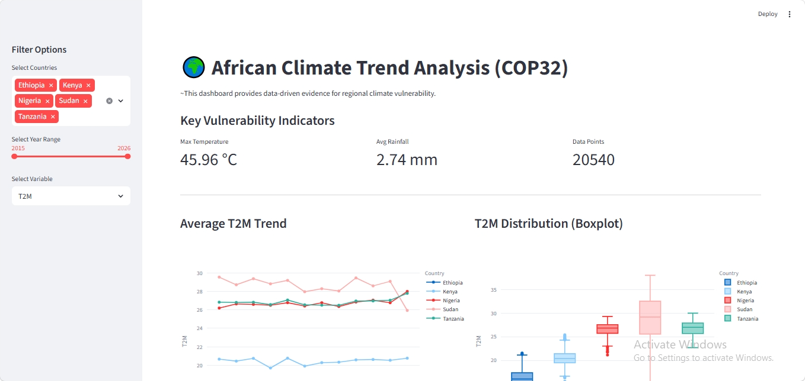

# Climate Change Analysis - Week 0
Analysis of climate trends in Africa (Ethiopia, Kenya, etc.) for COP32.

## How to Setup
1. Create a virtual environment: `python -m venv venv`
2. Activate it: `.\venv\Scripts\activate` (Windows) or `source venv/bin/activate` (Mac/Linux)
3. Install tools: `pip install -r requirements.txt`

## 🌍 Interactive Climate Dashboard (Bonus)
As part of the Decision Layer (Layer 3) of this project, an interactive dashboard was developed using Streamlit. This tool allows policy makers to visualize regional climate stressors in real-time, moving beyond static analysis.

### 🔗 Access & Deployment

Branch: dashboard-dev
#### ⚠️ Data Requirements (Local Run)
Note: The data/ folder is .gitignoreed to maintain repository efficiency. To run the dashboard locally:

1. Create Directory: Ensure a /data folder exists in the project root.

2. Add Files: Place your processed *_clean.csv files (from Task 2) inside that folder.

3. Run App: Execute streamlit run app/main.py from the root.

If the /data folder is empty, the app will trigger a "No objects to concatenate" error.

### 🛠️ Dashboard Architecture
The app follows a modular structure to ensure speed and interactivity:
* Reactive Filters: Users can filter the entire dataset by Country, Year Range, and Climate Variable ($T2M$, $PRECTOTCORR$, $RH2M$).
* Dynamic Visualizations: Powered by Plotly Express, providing interactive tooltips and zooming capabilities for time-series trends and distribution boxplots.
* Key Metrics: High-level KPIs that recalculate instantly based on user-selected filters, showing "Max Temperature" and "Average Rainfall" across selected regions.

## References & Self-Learning
- **WMO State of the Climate in Africa 2024:** Used to define baseline periods for anomaly detection.
- **World Bank Climate Risk Profiles:** Guided the selection of KPI thresholds (e.g., extreme heat at >35°C).
- **Pandas Documentation:** Researched the deprecation of the 'M' offset in favor of 'ME' for time-series resampling in Python 3.15.